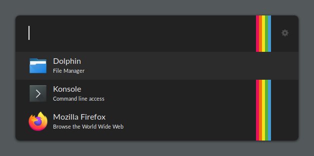

# Ulauncher Theme "Polaroid"

This is a dark theme for Ulauncher with a colorful accent.

*Note:* Keyboard shortcuts for search result items are hidden deliberately.

## Screenshot


## Installation

Clone this repository into the Ulauncher's theme directory:

```
cd ~/.config/ulauncher/user-themes
git clone https://github.com/wsdfhjxc/ulauncher-theme-polaroid.git polaroid
```

To enable the theme, open Ulauncher's settings and select it from a Color Theme list.

To uninstall the theme, just delete the `polaroid` directory that was created while cloning.
